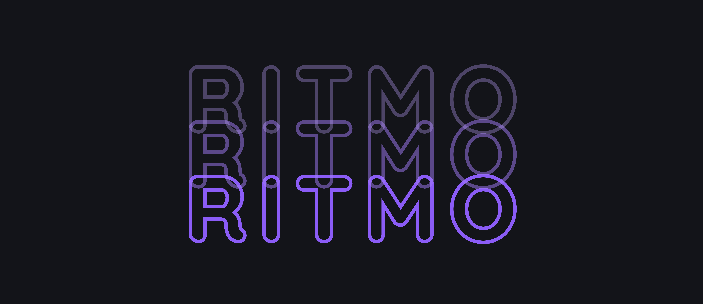
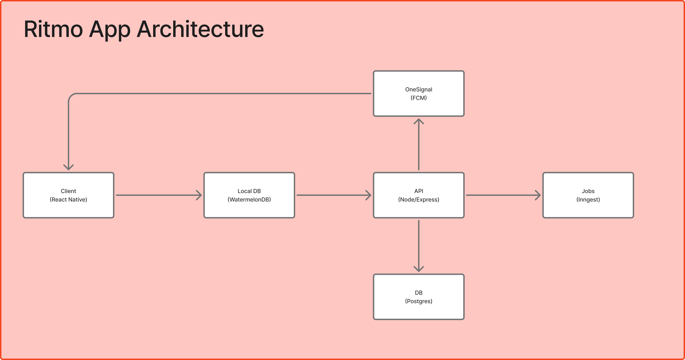

 

# Descrição
O Ritmo App é o seu espaço aconchegante para construir hábitos e organizar a rotina. Com um visual relaxante e cozy, o app transforma produtividade em algo leve e prazeroso, sem a pressão ou a frieza dos apps tradicionais.

Crie novos hábitos, monte cronogramas, defina lembretes e organize suas tarefas em um único lugar, tudo em um ambiente pensado para trazer calma ao seu dia a dia. Porque construir uma rotinha melhor não precisa ser estressante, pode ser, literalmente, confortável.

 

# Backlog

[Veja Aqui](./docs/backlog.md)

 

# Sprint Backlog

Em breve

 

# Arquitetura

 

# Tecnologias

**Front-end:**
- React Native
- React Navigation
- Nativewind
- WaterMelonDB
- Zustand
- React Hook Form
- Axios
- Tanquery Stack

 

**Back-end:**
- Node Express
- Prisma
- Zod
- Vitest + Supertest
- Pino